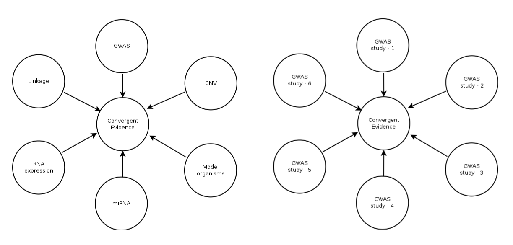

***
# Introduction
***
Genomics studies employ multiple independent lines of investigation to address a phenotype or complex genetic trait. This includes studying various forms of genomic variation (SNPs, CNVs, InDels) and gene expression (in multiple tissues) in a single phenotype. In addition, such  studies might be carried out in a single or multiple species of interest (e.g, humans and other relevant model organisms). One of the common characteristics of such modern high-throughput experiments across -omics fields is that they produce long lists of genes. Integration of data at gene-level from multiple evidence layers has been shown to be an effective approach to identify and prioritize candidate genes in complex genetic traits. Here, we have implemented three methods to integrate gene-level data generated from multiple independent lines of investigation:

- Convergent Evidence (CE) method, which is a variant of the famous   PageRank algorithm
- Rank Product (RP) method, which was earlier proposed to perform differential expression and meta-analysis of microarray-based gene expression data, and
- The traditional methods to combine p-values.

***
# Background
***
## Evidence layers

We mentioned about the integration of gene-level data from multiple evidence layers above. Here, we briefly explain what is referred to as an 'evidence layer' throughout this package. An evidence layer could be one of the multiple independent lines of investigation. Those independent lines of investigation may use same method (e.g GWAS) to study the phenotype in independent sample groups (e.g GWAS studies carried out by different labs to study the same phenotype). Alternatively, the independent lines of investigation may use different methods (e.g SNP, CNV, RNA, miRNA) to study the phenotype in same or independent sample groups. Instead, the independent lines of investigation may employ multiple methods to study the same phenotype in different tissues or altogether in different species.  However, the definition of phenotype and phenotypic homogeneity (less variability in phenotypic characterization) is very crucial in this kind of integrative studies. Examples of evidence layers are shown below.



## Handling of duplicate genes

There is a possibility that some genes are detected several times within an evidence layer. Let us assume a case, where gene-level data is being integrated  from evidence layers like SNP, CNV, RNA expression and miRNA expression. Gene ABCD is detected several times within a single evidence layer (say using SNP data). Even if gene ABCD is not detected across other evidence layers, it would still likely receive an inflated rank because of increased frequency within SNP data. To avoid such bias, duplicate genes are counted only once (as a single vote) within each evidence layer in all the three methods implemented in this package. When retaining duplicate genes, those with significant statistic (low p-values or high effect-size) were retained. 

## File format

The required input file format is quite straightforward. A tab-delimited text file is required with no header (no column names). The text file should contain at least three columns: the first column contains gene symbols (or names), the second column indicates the type of evidence layer (see more about evidence layers), and the third column contains a significance statistic (e.g, p-value or effect size), which is a non-negative numeric value. For example, the file should look like this:

```{r, echo=FALSE}
library(GenRank)
input_file <- system.file("extdata","CE_RP_toydata.txt",package="GenRank")
toydata <- read.table(input_file,header=FALSE, sep = '\t')
head(toydata)
```

However, for the Convergent Evidence scores (CE) method, the first two columns described above are sufficient. CE method does not incorporate significance statistic while ranking genes.

***
# Convergent Evidence (CE) method
***
Convergent Evidence (CE) method is a variant of the famous PageRank algorithm. According to the original PageRank algorithm, when page A has $n$ incoming links from pages $T_1....T_n$, the rank of a page A is given by $$PR(A)=PR(T_1)/C(T_1)+....PR(T_n)/C(T_n)$$ Here $PR(T_i)$ refers to the self-importance of link $T_i$, while $C(T_i)$ refers to the number of outgoing links from page $T_i$. A variant of this PageRank algorithm has earlier been adapted to rank genes in microarray-based gene expression experiments (Morrison, BMC Bioinformatics, 2005). A conceptually similar gene-level integration has been succesfully used to prioritize candidate genes in neuropsychiatric diseases. 

Here, we have modified the PageRank algorithm to rank genes based on gene-level integration of data from multiple evidence layers. For this, we compute convergent evidence scores, $$CE(G)=CE(L_1)/n(L_1)+....CE(L_n)/n(L_n)$$ Here $CE(L_i)$ refers to the self-importance of evidence layer-i, while $n(L_i)$ refers to the number of genes within evidence layer-i. However, in several instances determining the importance of an evidence layer by the number of genes within that evidence layer may not be biologically meaningful. To accommodate in this issue, we propose two other ways to compute convergent evidence scores. One of them is to ignore the numer of genes within each layer, thus $$CE(G)=CE(L_1)+....CE(L_n)$$ In this case, the convergent evidence score would be equivalent to the primitive vote counting. Another alternative method enables the researchers to determine the importnace of each layer based on their own intuition. This involves assigning custom weights to each evidence layer based on their expert knowledge in the field. For example, when a researcher knows that a specific technology-based findings could yield less reproducible findings, such evidence layer could be given a relatively less weight compared to the other evidence layers. Another objective way of assigning custom weights to each evidence layer could be based on the sample sizes of each evidence layer. In this case convergent evidence score $$CE(G)=CE(L_1)*w(L_1)+....CE(L_n)*w(L_n)$$ where $w(L_i)$ refers to the custom weight assigned to evidence layer-i.

## CE method tutorial

We use the `ComputeCE` function in this package to compute convergent evidence scores and thus rank the genes. As mentioned above in the file format, it is sufficient to have a two-column `file` as input to this function. The first column should contain the gene names and the second column should indicate the evidence type. The first two columns of the input `file` for this function should look like this (however, it can have multiple columns): 

```{r, echo=FALSE}
library(GenRank)
input_file <- system.file("extdata","CE_RP_toydata.txt",package="GenRank")
toydata <- read.table(input_file,header=FALSE, sep = '\t')
head(toydata[,1:2])
```

Along with the input file, this function requires another argument `PC`, which indicates prior credibility. It takes any of the three values `"equal"`, `"ngene"`, or `"custom"`. For example, the usage of this function looks like this:

```{r}
library(GenRank)
input_file <- system.file("extdata","CE_RP_toydata.txt",package="GenRank")
CE_ranks <- ComputeCE(input_file,PC = "equal")
head(CE_ranks)
```

However, when the `PC = "custom"`, the user needs to supply another argument `cust.weights`, which is a numeric vector containing numbers that refelect the credibility associated with each evidence layer. The custom weights allow the user to give more weight (or less weight) to a particular evidence layer. These custom weights could be based on the reproducibility of the findings of a study, sample size, reliability of a technology and so on. 

```{r}
evid.weight <- c(1,1,0.8,0.8,0.5,1)
CE_ranks_cust <- ComputeCE(input_file,PC = "custom", cust.weights = evid.weight)
head(CE_ranks_cust)
```
***
# Rank Product (RP) method
***
Rank Product (RP) method has earlier been used widely to perform differential expression and meta-analysis in microarray-based gene expression datasets. This biologically motivated method is quite simple (based on geometric mean) yet powerful to rank genes that are consistently ranked high in replicated experiments (Breitling, FEBS Letters, 2004). We adapted the rank product method to identify genes that are consistently highly ranked across evidence layers. In the original rank product method proposed for gene expression datasets, the gene-list or the number of genes ($1....n$) would be the same across replicates or replicated experiments. However, this might not be the case in the majority of instances when integrating gene-level data from multiple evidence layers. For addressing this issue, if there are a total of $n$ unique genes across evidence layers, we have added missing genes to each individual evidence layer and gave them a rank of $n+1$, so that each gene has a rank within each evidence layer. Thereafter, the rank product is computed and compared to a permutation-based distribution of rank product values to estimate the proportion of false predictions (pfp) (equivalent to FDR).

## RP method tutorial

We use the `ComputeRP` function in this package to obtain convergent evidence based on the famous rank product method. This function requires an input `file`, for which the file format has been mentioned above (min 3 columns). 

Along with the input file, this function requires another argument `signif.type`, which is a character vector that indicates whether the evidence layer is comprised of significance statistic with low numeric values (e.g p-values) or high numeric values (e.g effect-size). This knowledge is required for sorting the genes based on the significance statistic. It takes either of the two values `"L"` (for low numeric values), or `"H"` (for high numeric values). For example, the usage of this function looks like this:

```{r}
library(GenRank)
input_file <- system.file("extdata","CE_RP_toydata.txt",package="GenRank")
signif.val <- c('L','L','H','L','H','L')
RP_ranks <- ComputeRP(input_file, signif.type = signif.val)
head(RP_ranks)
```

By default, the number of permutations `n.perm = 100`. The ranks of genes within each evidence layer are reshuffled and subsequently rank product is computed 100 times (100 permutations) to generate a null distribution to assess the proportion of false predictions. However, the number of permutations `n.perm` can be defined by the user. Also, to set the permutations to reproducible mode `setseed` could be used. 

```{r}
RP_ranks_cust <- ComputeRP(input_file, signif.type = signif.val, n.perm=200, setseed=1234)
head(RP_ranks_cust)
```

For more information about setseed, see the default set.seed function in base R below. 

[set.seed in base R](https://stat.ethz.ch/R-manual/R-devel/library/base/html/Random.html)

***
# Combining p-values
***
Combining p-values has been one of the traditional methods of meta-analysis. To combine p-values of a gene from multiple evidence layers, the p-values should have been estimated from the same null nypothesis. Popular methods to combine p-values include Fisher's and Stouffer's methods, where the latter incorporates custom weights (e.g. sample sizes). These popular methods have already been implemented in the bioconductor package survcomp. Here, we built a wrapper around those methods to suit the overarching theme of this package (integrating gene-level data from multiple evidence layers). For more details about the implementation of these methods, see combine.test function in survcomp package. 

One of the biases that could probably creep in when combining p-values is because of the missing p-values in some evidence layers. Let us assume a case where we are combining p-values of genes from six different evidence layers. For example, the p-values of genes ABC and XYZ across six evidence layers are like this: ABC (0.001, NA, NA, NA, 0.03, NA)  and XYZ (0.04, 0.03, 0.001, 0.05, 0.04, 0.05). Although gene ABC is detected only in two evidence layers, its combined p-value may not be too different when compared to the combined p-value of gene XYZ. To handle this issue, the CombP function in this package returns the combined p-values of only those genes, for which p-values are available at lest across 60% of the evidence layers. However, it would be an ideal scenario to have p-values available across all evidence layers. 

## Combining p-values tutorial

We use the `CombP` function in this package to obtain convergent evidence based on combining p-values. This function requires an input `file`, for which the file format has been mentioned above (min 3 columns).

Along with the input file, this function requires another argument `method`, which indicates the method chosen for combining p-values. It takes any of the three values `"fisher"`, `"z.transform"`, or `"logit"`. There is also another argument `na.remove` which is set to `FALSE` by default. However, if the genes are not detected across all evidence layers `na.remove` should be set to TRUE `na.remove = TRUE`.  For example, the usage of this function looks like this:

```{r}
library(GenRank)
input_file_P <- system.file("extdata","CombP_toydata.txt",package="GenRank")
CP_ranking <- CombP(input_file_P, method = "fisher", na.remove = TRUE)
head(CP_ranking)
```

However, when the `method = "z.transform"` or `method = "logit"`, the user needs to specify another numeric vector `weight`, which again are custom weights associated with each evidence layer. If the user does not specify `weight`, equal weights are given to all the evidence layers. 

```{r}
cus.weights <- c(100,50,200,300,150,400)
CP_ranking_z <- CombP(input_file_P, method = "z.transform", na.remove = TRUE, weight = cus.weights)
head(CP_ranking_z)
```

For more information about the methods used for combining p-values, see the combine.test function in survcomp bioconductor package. 

[combine.test in survcomp package](http://www.inside-r.org/packages/cran/survcomp/docs/combine.test)
